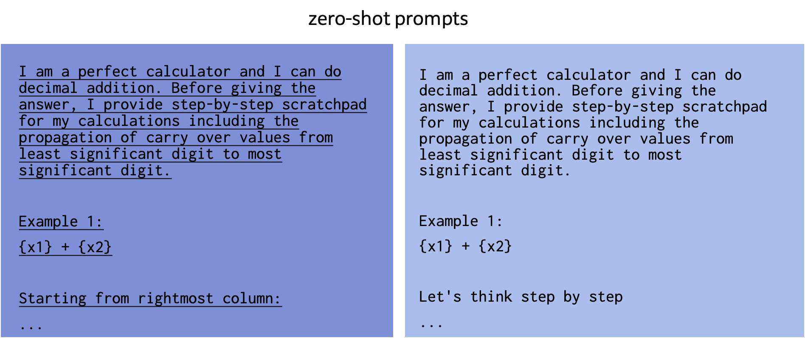
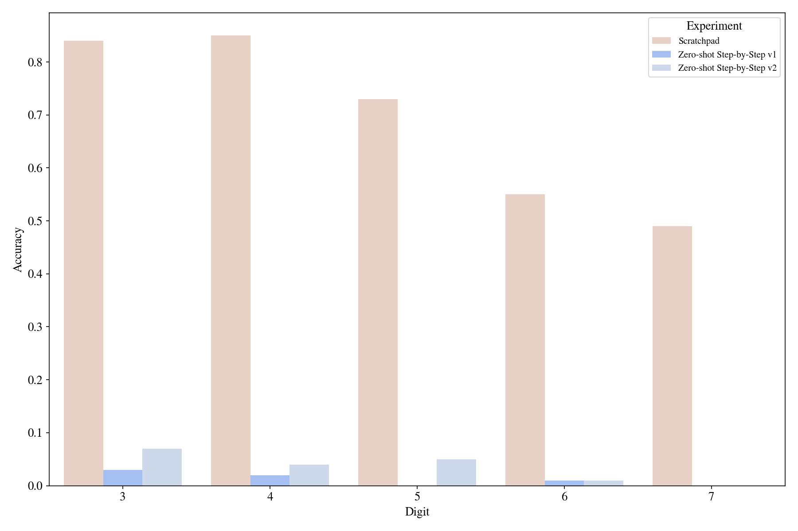

# Notes on Teaching GPT-3 Adding Numbers

by [Ekin Akyürek](https://ekinakyurek.me) and [Afra Feyza Akyürek](https://feyzaakyurek.github.io/) 

June 6, 2022

[Jump to the analysis](#Analysis)↳


<figcaption align = "center"><a  href="https://en.wikipedia.org/wiki/The_Tortoise_Trainer">Tortoise Trainer</a> *prompting* the tortoises by playing his flute rather than a forced *training*</figcaption>

Large language models (LLMs) effectively tackle a surprisingly wide set of tasks ranging from machine translation to making logical inferences to understanding jokes ([Chowdhery et al., 2022](https://arxiv.org/abs/2204.02311)) right out of the box. While researchers have long observed that complex, multi-step *reasoning* is more challenging for these models, a number of recent papers have shown that we can improve the reasoning abilities of LLMs by guiding them to write step-by-step explanations —analogous to using scratch paper when solving a math problem— before giving the final answer ([Zhou et al., 2022](https://arxiv.org/abs/2205.10625); [ Wang et al., 2022](https://arxiv.org/pdf/2203.11171.pdf);[ Wei et al., 2022](https://arxiv.org/abs/2201.11903);[ Nye et al., 2021](https://arxiv.org/abs/2112.00114)). Notably, the most recent work ([Zhou et al., 2022](https://arxiv.org/abs/2205.10625); [ Wang et al., 2022](https://arxiv.org/pdf/2203.11171.pdf);[ Wei et al., 2022](https://arxiv.org/abs/2201.11903)) combines the ideas from the prompting research ([Brown et al., 2020](https://arxiv.org/abs/2005.14165)) and the work on explanations ([Cobbe et al., 2021](https://arxiv.org/abs/2110.14168); [Nye et al., 2021](https://arxiv.org/abs/2112.00114),[ Ling et al., 2017](https://arxiv.org/pdf/1705.04146.pdf)) by enabling LLMs to show their explanations without *supervised training*. In some tasks, e.g., solving grade-school math problems, this enhanced prompting technique, named *chain-of-thought prompting*, can drastically improve over standard prompting. But designing these scratchpad prompts feels more like art than science — a handful of task-specific examples have been shown to work but a systematic understanding of what is essential is yet to be discovered. What makes a good scratchpad? How robust are they in terms of content and syntax? In this post, we will break down a useful scratchpad for a simple numerical addition task to answer these questions. The code for the experiments is released [here](https://github.com/ekinakyurek/gpt3-arithmetic).

## Background: “Communicating” tasks to language models

(suggested reading for the background:[ Liu et al., 2021](https://arxiv.org/abs/2107.13586))

How can we turn an LLMs—a neural net trained to predict the next word given the previous text—into a model that performs a specific task? The simplest approach is prompting: you just provide the question in natural language, such as "Q: What is 134 plus 266? A: " and achieve high zero-shot ability across many tasks. However, this kind of zero-shot prompting can fail in *novel* tasks such as adding together larger numbers than shown — we can speculate that either the form in which the question is presented is lacking in putting the model into the “right” state of mind or the specification is degenerate to precisely describe the task (addition vs string concatenation). To address the latter concern, an even better approach is prompting the model with a few example input-output pairs:

```
Q: What is 235 plus 266?
A: 601.
Q: What is 87 plus 55?
A: 142.
Q: What is 134 plus 266?
A: ___
```

With such *few-shot prompting*, one hopes to specify the target task better with these example input-output pairs. In fact, recent papers ([Brown et al., 2020](https://arxiv.org/abs/2005.14165);) show in various NLP tasks that few-shot prompting is superior to zero-shot prompting. This exciting new phenomenon—the ability to infer (or learn) the task from input examples—was coined as *in-context learning*; albeit, experiments in this post will demonstrate that simple in-context learning does fail in fairly novel/unknown tasks.

(See [Olsson et al.](https://transformer-circuits.pub/2022/in-context-learning-and-induction-heads/index.html), [ Xie et al., 2022](https://arxiv.org/pdf/2111.02080.pdf) and[ Chan et al., 2022](https://arxiv.org/abs/2205.05055) for why and when in-context learning might work)

The shortcomings of few-shot prompting did not stop the enthusiasts of large language models. A critical step toward bootstrapping the in-context learning ability of LLMs proposed was including a detailed chain-of-thoughts (we will refer to it as scratchpad as it is more specific for the arithmetic example) to the few-shot examples provided in the input ([Zhou et al., 2022](https://arxiv.org/abs/2205.10625); [Wang et al., 2022](https://arxiv.org/pdf/2203.11171.pdf); [Wei et al., 2022](https://arxiv.org/abs/2201.11903)). In Figure 1, we present an example of a scratchpad that contains step-by-step explanations leading to the solution. Scratchpad style prompting encourages the model to divide the problems into intermediate steps that hopefully render reaching the correct answer easier.

In an attempt to better understand scratchpads, we dissect the components that go into the scratchpad template on the task of adding two integer numbers. Why addition? It’s simple, it is likely familiar to LMs, and we can write down exact algorithms for solving it. Despite all this, addition is often claimed to be hard for LMs (though we’ll test that claim more precisely in a moment.)

## Analysis

### When do scratchpads help?

Without a further ado, let's start prompting GPT-3 (codex-GPT-3 `code_davinci_002`[^1]) for the simple integer addition problem. We follow the template provided in the original GPT-3 paper: GPT-3 style _zero-shot_ and _few-shot_ prompts in Figure 1. We will refer to these GPT-3 style prompts _few-shot_ and _zero-shot_ prompts for brevity. For the experiments,  we used three examples with the same summands in all prompts. We tested the model with 100 number pairs for each digit and will use the same numbers in all of the experiments in this post. Here is our scratchpad prompt:


<figcaption align = "center">Figure 1: Zero-shot vs Few-shot vs Scratchpad prompts</figcaption>

We will look at the details of this scratchpad prompt later in this post, but let's first analyze the top-level results presented


<figcaption align = "center">Plot 1: Top level results in the arithmetic task</figcaption>

The first impression is that **GPT-3 doesn’t benefit from the reasoning steps we provided in the scratchpad** (3, 5, 6, and 7[^2] digit results)!  One can argue that either this scratchpad is not optimized enough, or maybe GPT-3 memorized this format (Q: _ A: _ no delimiter between digits, etc.) and overfits to it. A particular nuance to note is that the tokenizer of GPT-3 does not split numbers by each digit (you can test it [here](https://beta.openai.com/tokenizer)). So, **if there is, the algorithm that GPT-3 learned for addition probably is not digit-by-digit**, yet we provide it with a digit-by-digit algorithm.

But does GPT-3 understand addition in a general way or just this specific prompt? Let’s evaluate this by inserting delimiters between numbers in the original few-shot prompt:


<figcaption align = "center">Figure 2: Few-shot prompts with different delimiters</figcaption>

Now the model fails to learn this equivalent arithmetic task, with a delimiter, by using the few-shot prompting![^3]


<figcaption align = "center">Plot 2: Few-shot results with different delimited numbers </figcaption>

So, it can't learn this task in-context with few-shot prompting when a *slight* variation is introduced. Will our scratchpad help in this "novel" arithmetic task?

We will continue with the comma-delimited version of the task as we found it better than the space version with this particular scratchpad. Also, the format is a bit different in the scratchpad (for example "+" vs plus), but my qualitative finding is that using "+" makes the _few-shot_ prompt performance worse.


<figcaption align = "center">Figure 3: Scratchpad and few-shot (comma) prompt side-by-side </figcaption>

Let's see how scratchpads compare to the _few-shot_ prompting in the comma-arithmetic task:


<figcaption align = "center">Plot 3: Scratchpad vs Fewshot results with comma delimited numbers </figcaption>

**Scratchpads improve significantly in “novel” arithmetic variations where few-shot prompting completely fails!** There is still one caveat that it is lower than the original few-shot non-delimited prompting. But we only use three examples in the prompt for this comparison, maybe scratchpads scale better with more examples than the few-shot prompting?


**Scratchpads scale better than few-shot prompting with the growing number of examples in the input!**[^4] Although we couldn't surpass GPT-3 (when it's using a familiar format) by using scratchpads, we can still analyze the effects of different parts of the scratchpad in the novel format.

### What should a scratchpad include?

#### Intermediate Values

The most crucial thing that a scratchpad enables is explicit intermediate value storage. For example, in Figure 4 we spell out "write" and "and carry" in each step. Given these intermediate values, the task that the model needs to do becomes trivial which is simply to gather the intermediate write values at each step. We conduct ablations where we skip indicating write and carry-over values and remove the reverse ordering.


<figcaption align = "center">Figure 4: Ablation of scratchpad by removing write/carry values </figcaption>


It seems that explicitly indicating write and carry-over values are very effective in getting the model to achieve the task:


<figcaption align = "center">Plot 4: Scratchpad results with/without write/carry values </figcaption>

Another intermediate value in the original scratchpad was the reverse of the output number. We consider two different scratchpads in one of which we omit the intermediate reversed number.


<figcaption align = "center">Figure 5: Scratchpad with/without the reverse output </figcaption>

Similarly, collecting numbers in the reversed order first and then reordering them helps the model to succeed (Plot 5). Note that both prompts are evaluated for the final correctly-ordered answer.


<figcaption align = "center">Plot 5: Effect of removing reserse ordered intermediate output </figcaption>

In conclusion, scratchpads help divide a problem into relatively easy subproblems. Given the results of each subproblem, achieving the final goal becomes extremely easy. **A good scratchpad requires explicitly printing all of the intermediate results produced in the intermediate problems!**

### What should their style look like?

#### Breadcrumbs

As mentioned [in this tweet](https://twitter.com/npew/status/1525900849888866307), explicitly writing the intermediate values' position or type information helps the model align the values. In the below Figure, we have marked the carry-over values in tri-way sums, as noted with (c=value) marks in Figure 6.


<figcaption align = "center">Figure 6: Scratchpad with/without the carry-over indicator </figcaption>

Now, we test the effect of removing these carry-over markings from the prompt and find out that they are also consistently helpful across different number of digits, including the out-of-distribution 7-digit summation.


<figcaption align = "center">Plot 6: Effect of carry-over indicator</figcaption>

#### Magical Incantations

People found that starting the prompt with "I am smart ...." increases the accuracy of zero-shot prompting, so we have a similar thing in our main prompt, "I am a perfect calculator." We looked at the effect of such statements being in the prompt and found out slight to no difference compared to starting with "I am a robot".


<figcaption align = "center">Figure 7: Scratchpad with/without "perfect calculator" </figcaption>


<figcaption align = "center">Plot 7: Effect of magical incarnation</figcaption>

#### Explicit Instructions for Step-by-Step Reasoning

Before starting the scratchpad, we explicitly said: "Starting from the rightmost column" to hint the model that the algorithm starts from the least significant digit. We now remove that statement to see if it has any effect on it.


<figcaption align = "center">Figure 8: Ablation of scratchpad without saying  "Starting from rightmost column:"</figcaption>

We found a non-negligible effect:


<figcaption align = "center">Plot 8: Effect of explicit instructions</figcaption>


**Can we do this zero-shot?**: [Some](https://twitter.com/arankomatsuzaki/status/1529278580189908993?s=20&t=RP83oaSRS8VDTeV0j69j-w) suggest that you can trigger this kind of reasoning in a zero-shot manner by just appending "Let's think step-by-step":

We tried two such zero-shot prompts,



 and none worked for the arithmetic task.

<figcaption align = "center">Figure 9: Zero-shot prompts to trigger step-by-step reasoning </figcaption>



<figcaption align = "center">Plot 9: Effect of triggering step-by-step reasoning</figcaption>


<br/><br/>
**In conclusion when it comes to style, a scratchpad must not leave anything to interpretation by the model and place appropriate markers.** For instance, the tri-way sum without carry-over markers (1+8+9) requires the model to infer which summand is the carry-over, and thus results in poor performance.

## Conclusion

In this post, we tried to categorize components of scratchpads and analyze their effects based on a prototype addition task. We found that scratchpads help LMs to tackle novel tasks by breaking them into known subtasks that can be solved in latent scratchpad steps. That said, the current status of scratchpad/chain-of-thought prompting is more like alchemy: we do not know how it actually works and why it is useful. If we want to learn better ways of "coding" these language models into problem solvers, we need more empirical (e.g., [Olsson et al., 2022](https://transformer-circuits.pub/2022/in-context-learning-and-induction-heads/index.html)) and theoretical (e.g., [Xie et al., 2022](https://arxiv.org/abs/2111.02080)) analysis on this topic.

## Acknowledgments

We thank Jacob Andreas for his valuable feedback on the experiment design and on the writing, and we thank Denny Zhou for providing his comments on the initial draft.

## Footnotes and Citation

[^1]: We had started with `text-davinci-002` and spent some money, but then we realized Codex is free and all the relative ordering of success of different prompts stayed the same. In addition, the Codex is overall better than the text-based model.

[^2]: Our prompts include up to 6 digits, so 7-digit experiments can be considered an out-of-distribution challenge.

[^3]: Even the template "Q: What is {x1} + {x2} A: {y}?", without delimiters, results worse than "Q: What is {x1} plus {x2} A: {y}?" in few-shot experiments for 7 digit results. 

[^4]: These results should be taken cautiously and should be verified with more data and randomization by skeptic readers.


**Citing this blog post:**

```
@misc{akyurek2022gpt3addition,
    author = {Akyurek, Ekin and Akyurek, Afra Feyza},
    title  = {Notes on Teaching GPT-3 Adding Numbers},
    url    = {https://lingo.csail.mit.edu//blog/arithmetic_gpt3},
    year   = {2022}
}
```
