# Notes on Teaching GPT-3 Adding Numbers

Let's start by acknowledging how we can *communicate* with large language models (LLMs) that were simply neural nets trained to predict the next thing given the previous text. This interaction is pretty simple: you just provide the model the instructions in human languages, such as "Translate the following sentence to English: <sentence>," and achieve unprecedented zero-shot ability in machine translation.  Perhaps because of the simplicity, many startups strive to find a software-as-a-service product powered by such single models alone. However, these models can fall short in *novel* tasks with such simple instruction prompting (i.e., zero-shot prompting) &ndash; somewhat, the instructions that we provide are not enough to put the model into the right mind for a particular task or instructions are degenerate to specify the task in mind.

Therefore, even better approach is prompting the model a few example input-output pairs along with instructions, "Translate the following sentences to English: 1) <sentence1>: <translation1>, 2) <sentence2>: <translation2>, 3) <sentence3>:". So, we can hope to specify the target task better with these example input-output pairs. Recent papers show in various NLP tasks that few-shot prompting is superior to zero-shot prompting and try to understand this phenomenon in detail. People often refer to this instantaneous learning ability as in-context learning, meaning that the model can learn from input examples; however, our experiments in this post suggest that few-shot prompting fails in fairly novel/unknown tasks.

The shortcomings of few-shot prompting did not stop the enthusiasts of large language models. A critical step towards bootstrapping the in-context learning ability of LLMs proposed was adding a detailed chain of thoughts or a scratchpad to the few-shot examples given to the model. In Figure 1, we present an example of a scratchpad that contains step-by-step explanations leading to the solution. Chain-of-thought prompting encourages the model to divide problems into intermediate steps that hopefully make the final answer easy to find.

To investigate this phenomenon systematically, I took an exploration on tackling teaching GPT-3 by adding two numbers, something simple that we know the algorithm for it, with the aid of scratchpads. Before I get your hopes high, you shouldn't take this as the most systematic approach to understanding this phenomenon but rather a quest for understanding where and why they can be helpful or not.

Without a further due, let's start prompting GPT-3 (codex-GPT-3 `code_davinci_002`[^1]) for the simple integer addition problem.  I follow the template provided in the original GPT-3 paper for zero-shot and few-shot prompts in Figure 1. I used three examples with the same summands in few-shot and scratchpad prompts. I tested the model with 100 number pairs for each digit and will use the same numbers in all of the experiments in this post.

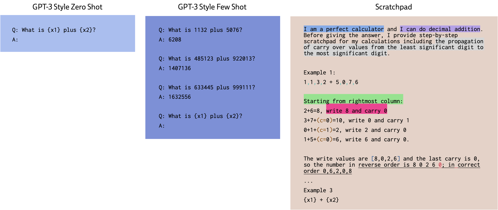

We will look at the details of the scratchpad prompt later in the blog, but let's first analyze the top-level results presented below.

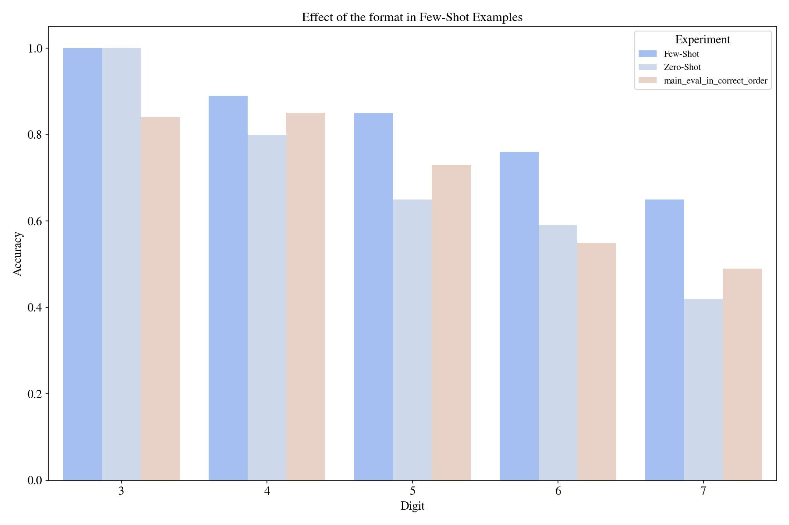

The first impression is that GPT-3 can't benefit from the reasoning steps we provided in the scratchpad (3, 5, 6, and 7 digit results). Possible reasons for this: (1) the format in zero- and few-shot of GPT-3-style is familiar, and the scratchpad that we provide is not, (2) this scratchpad is not optimized enough, or (3) maybe GPT-3 memorized this format (Q: _ A: _ no delimiter between digits, etc.) and overfits to the format? The answer is related to the tokenizer of GPT-3, which doesn't split numbers by each digit; you can see this on the playground of the API by typing a number and hitting the generate button: on the bottom-right, it displays the number of tokens. So, if there is, the algorithm that GPT-3 learned for addition probably is not digit-by-digit, yet we gave it a digit-by-digit algorithm.  Let's try to consolidate this conjecture a bit more using delimiters between numbers in the original few-shot prompt:

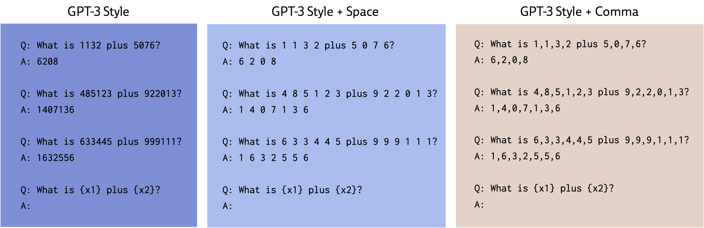

Now the model fails to learn this equivalent arithmetic task with a delimiter!

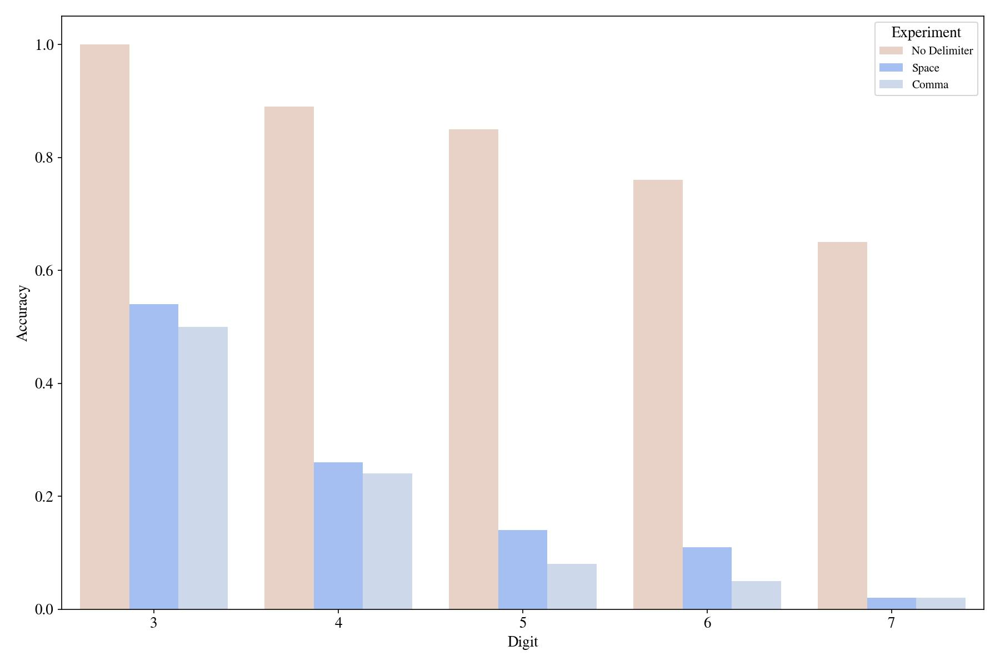

So, it can't learn this task in-context with few-shot prompting when a *slight* variation is introduced. Maybe in this "novel" arithmetic task, our scratchpad will be helpful? I will continue with the comma-delimited version of the task as I found it better than the space version with this particular scratchpad.

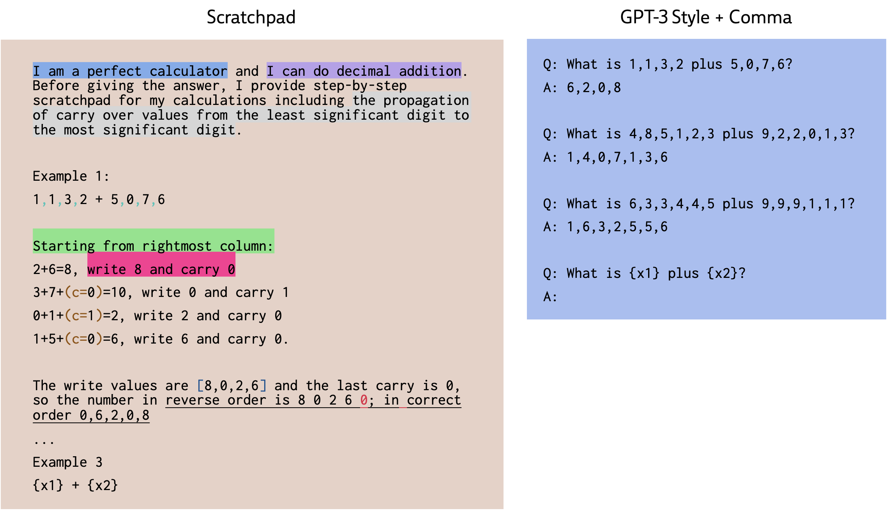

Similarly, the format is a bit different in the scratchpad (for example + vs plus), but my qualitative finding is that it does make the few-shot one worse.

Can scratchpads now teach the model the comma-arithmetic task?

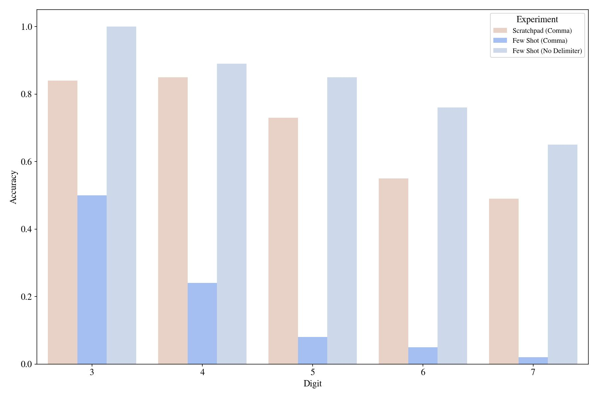

It seems like yes, with the caveat that it is lower than the original few-shot non-delimited arithmetic prompting. But we can still analyze the effects of different parts of the scratchpad.

## Scratchpad Content

### Intermediate Values

The most crucial thing scratchpad provides is intermediate value storage. For example, in Figure X, we note write/carry values in each step. Given these intermediate values, the computation that the model needs to do becomes an effortless task, e.g., gathering write values to the current position, so overall computation. We experiment by removing to note write/carry values and removing the reverse ordering.

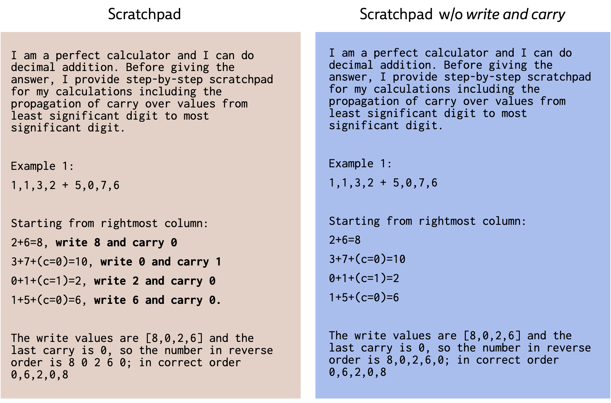

It was very effective in getting the model to achieve the task.

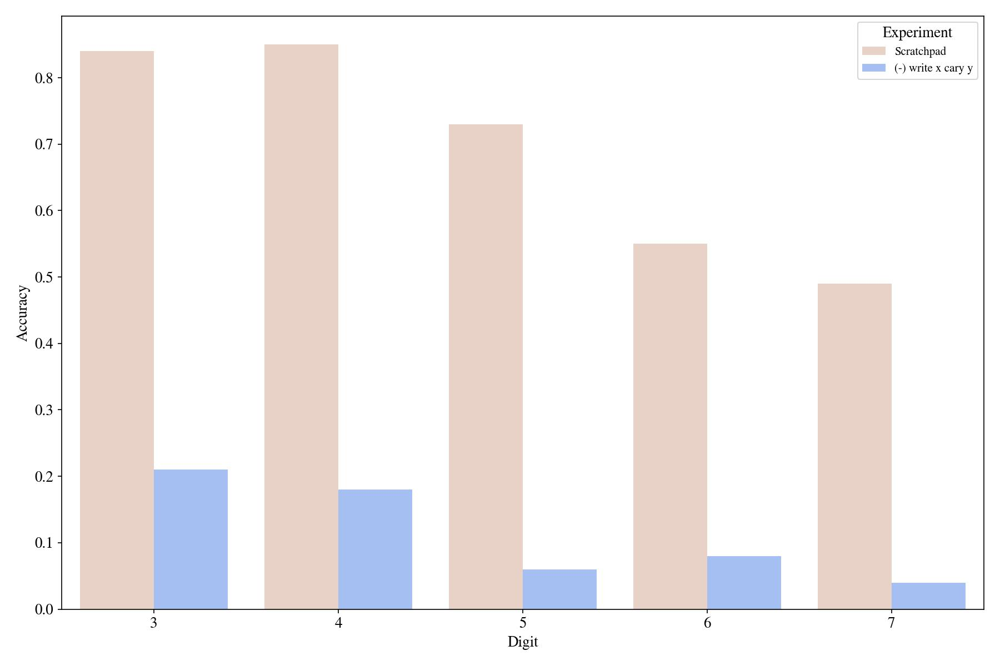

Another intermediate value in the original trackpad was the reverse of the output number. We tried two different scratchpads without the intermediate reverse number.

 [TODO: put the prompts]

[TODO explain]

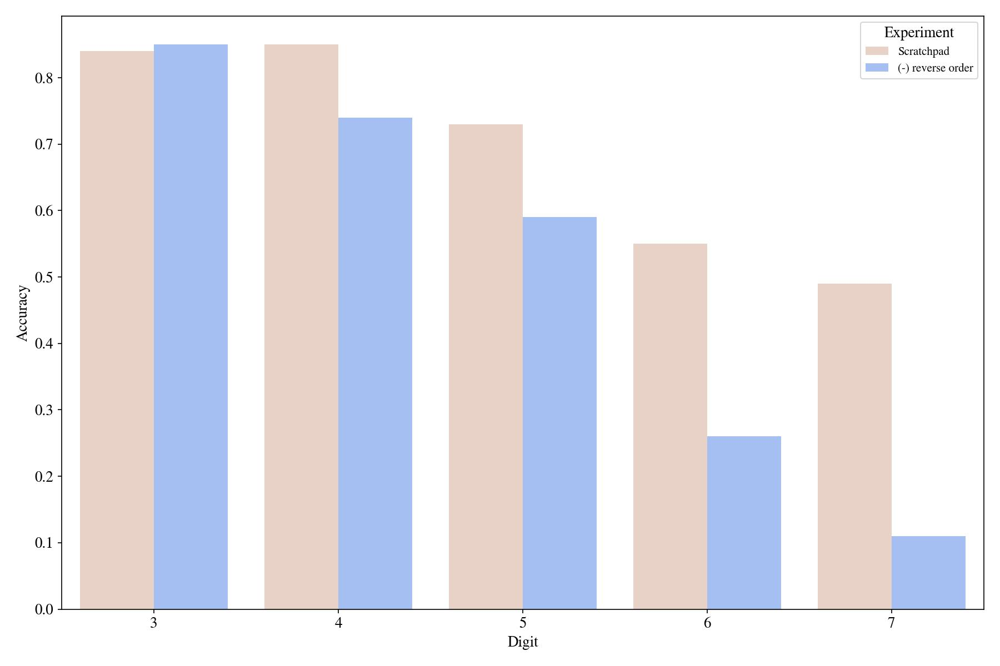

In conclusion, scratchpads divide a problem into relatively easy subproblems. After saving the results of each subproblem in the output, achieving the final goal becomes very trivial.

## Scratchpad Style

### Breadcrumbs

As mentioned [here](https://twitter.com/npew/status/1525900849888866307), explicitly writing the intermediate values' position or type information helps the model align the values. In the below Figure, we have marked the carry-over values in tri-way sums, as you can see in the below Figure as (c=value) marks.

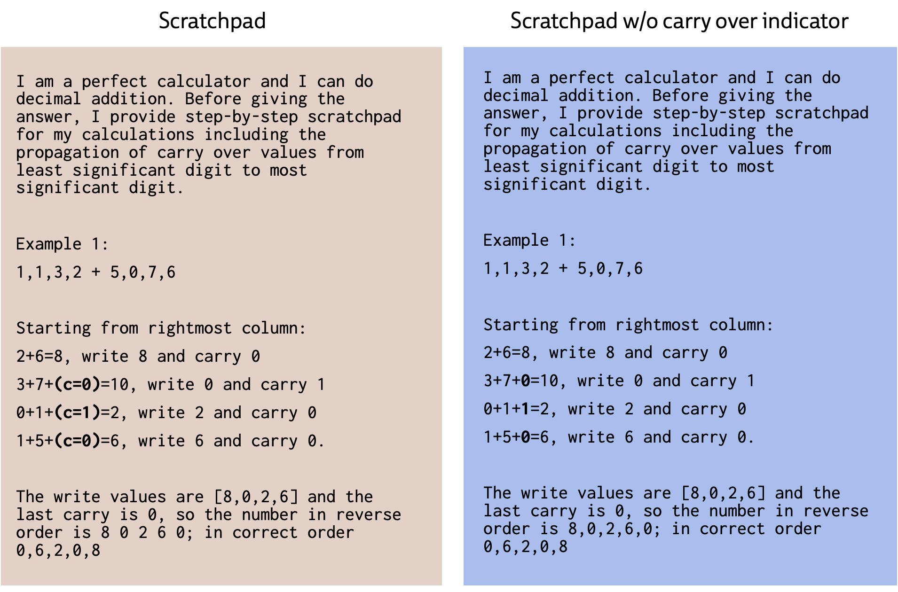

Now, we test the effect of these carry-over markings.

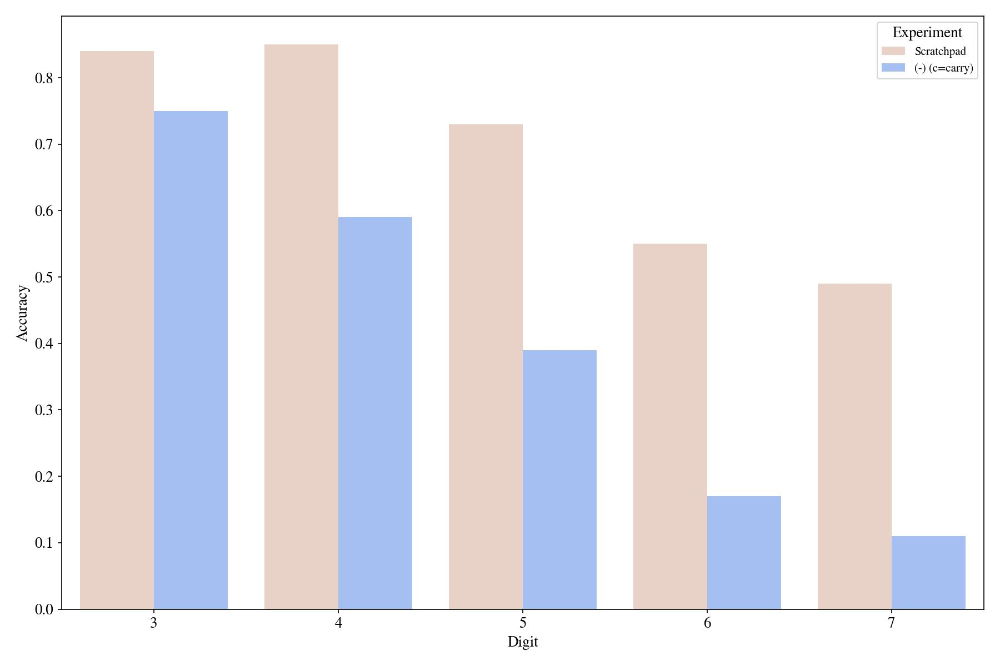

### Magic Incarnations

People found that starting the prompt with "I am smart .." increases the accuracy of zero-shot prompting, so we have a similar thing in our main prompt, "I am a perfect calculator." We looked at its effect of it.

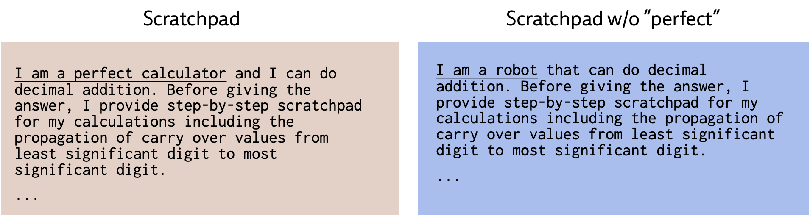

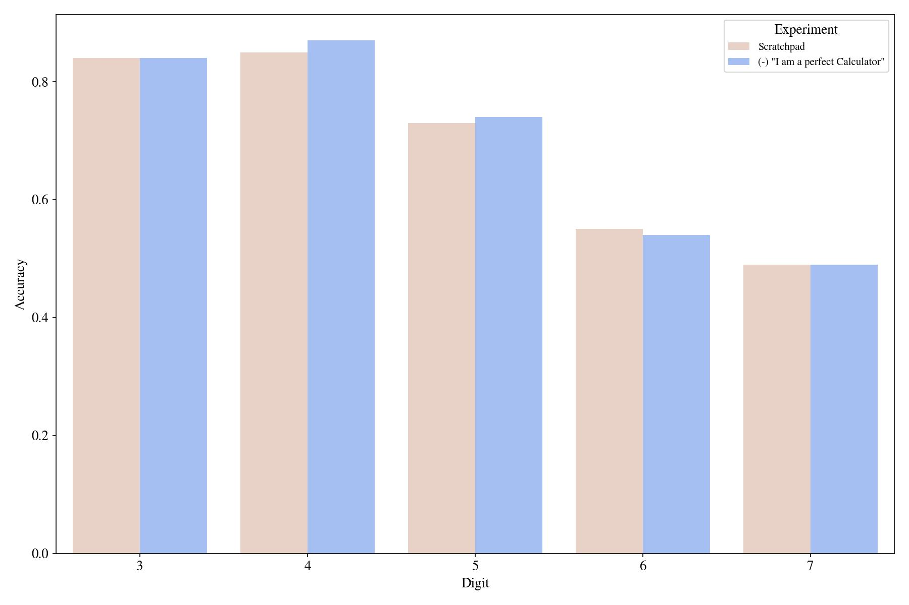

### Explicit Instructions

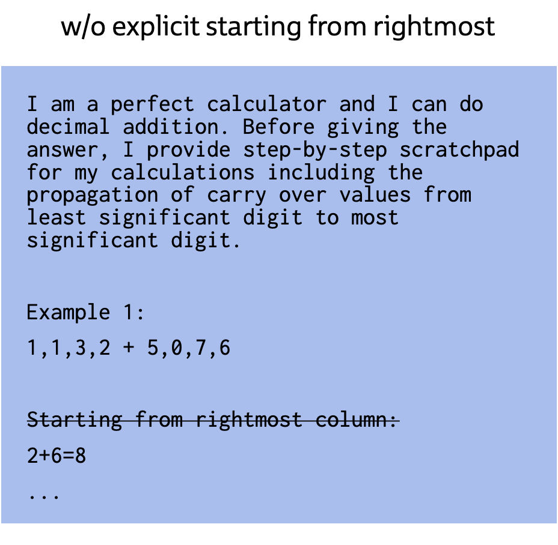

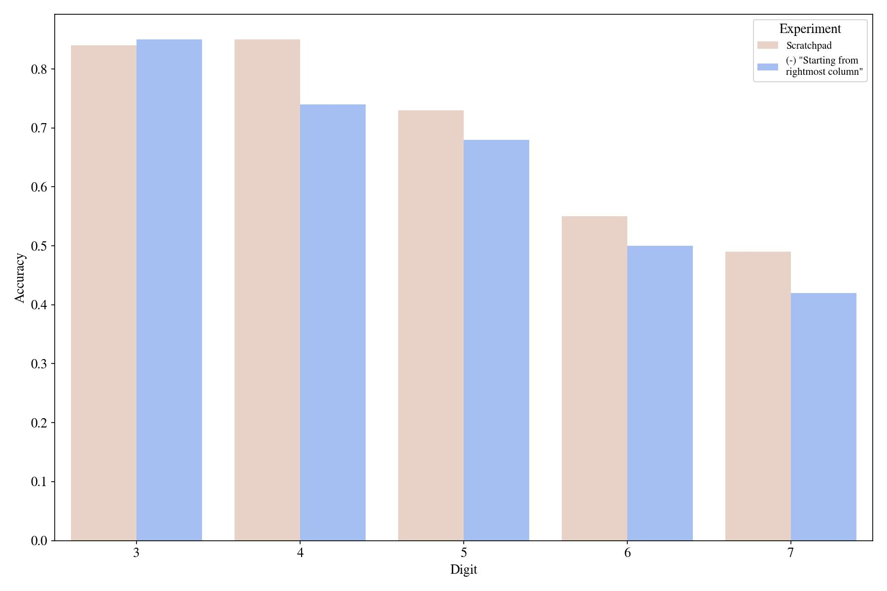

## Can we do zero-shot?

Some suggest that you can trigger this kind of reasoning in a zero-shot manner by just appending "Let's think step-by-step" as in [here.](https://twitter.com/arankomatsuzaki/status/1529278580189908993?s=20&t=RP83oaSRS8VDTeV0j69j-w)

I tried a couple of prompts and none of them worked [TODO continue]

[TODO add references]

[^1]: We had started with text-davinci-002 and spent some money, but then I realized codex is both free, and all of the relative ordering of prompts stayed the same. Plus, the codex is overall better than the text-based model..

